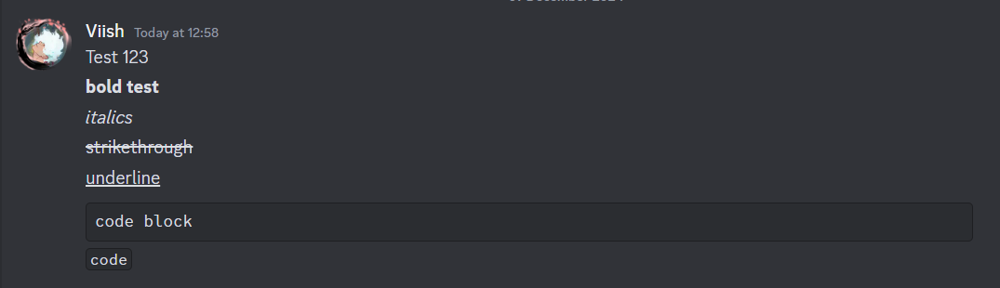

---

# Discord.js-selfbot-v13 Selfbot Transcripts

[](https://discord.gg/viish)

**Discord.js-selfbot-v13 Selfbot Transcripts** is a **modified version** of [discord-html-transcripts](https://github.com/ItzDerock/discord-html-transcripts) designed to generate visually appealing HTML transcripts for Discord messages. It processes Discord markdown like **bold**, _italics_, ~~strikethroughs~~, and more while formatting attachments and embeds beautifully. Built-in XSS protection prevents users from inserting HTML tags.

### Updated Features:
- **Dynamic Favicon**: The favicon updates based on the channel's avatar (DMs or server channels), providing a more personalized browsing experience.
- **Dynamic Tab Title**: The tab title now reflects the current channel's name (or the recipient's username for DMs), making it easier to identify the content you are viewing.

**This module is built purely for fun purposes with no intent to violate Discord's Terms of Service. Use it responsibly.**

**Note:** This module is tailored for use with [discord.js-selfbot-v13](https://discordjs-self-v13.netlify.app/#/) v3.4.2.

HTML template credits to [DiscordChatExporter](https://github.com/Tyrrrz/DiscordChatExporter).

---

## Example Output



---

## Usage

### Example Usage with Built-in Message Fetcher

```js
const discordTranscripts = require("discord-selfbot-transcripts");

const channel = message.channel; // or however you get your TextChannel

// Must be awaited
const attachment = await discordTranscripts.createTranscript(channel);

channel.send({
  files: [attachment],
});
```

### Or Provide Your Own Messages

```js
const discordTranscripts = require("discord-selfbot-transcripts");

const messages = someWayToGetMessages(); // Must be Collection<string, Message> or Message[]
const channel = someWayToGetChannel(); // Used for ticket name, guild icon, and guild name

// You do not need to await this
const attachment = discordTranscripts.generateFromMessages(messages, channel);

channel.send({
  files: [attachment],
});
```

---

## Configuration

### Built-in Message Fetcher

```js
const attachment = await createTranscript(channel, {
  limit: -1, // Max amount of messages to fetch.
  returnBuffer: false, // Return a buffer instead of a MessageAttachment
  fileName: "transcript.html", // Only valid with returnBuffer false. Name of attachment.
});
```

### Providing Your Own Messages

```js
const attachment = await generateFromMessages(messages, channel, {
  returnBuffer: false, // Return a buffer instead of a MessageAttachment
  fileName: "transcript.html", // Only valid with returnBuffer false. Name of attachment.
});
```

---

**Disclaimer:** This modified version is a fork of [discord-html-transcripts](https://github.com/ItzDerock/discord-html-transcripts) and is created solely for fun purposes. It is not intended for misuse or to violate Discord's Terms of Service. Always ensure compliance with platform policies when using such tools.

---
